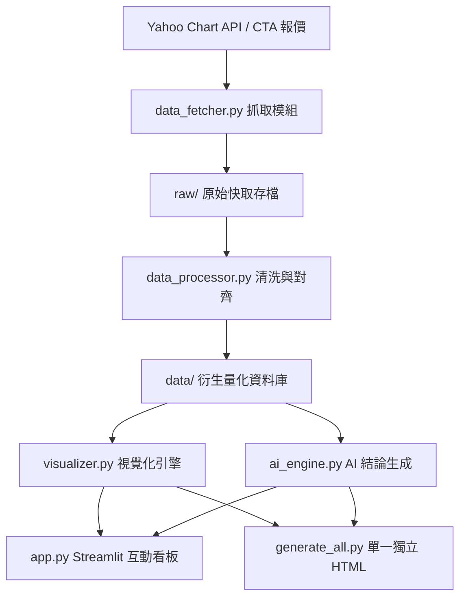

# 專案執行計畫 (PLAN.md)｜第六組：匯率與出口股連動

> **題目**：題 6｜外匯與指數監控（群益 CTA 平台 / 公開資料源連動）  
> **目標**：建構多幣別匯率（USD/TWD, USD/JPY, USD/CNY/CNH, DXY）與台灣四大出口族群（半導體、電子代工、航運、自行車）之量化連動監控與關稅事件研究工具。

---

## 🎯 核心目標與交付成果

1. **五關卡生產線落地**：
   - **一、抓**：多幣別匯率（DXY, TWD=X, JPY=X, CNY=X, CNH=X）與台灣出口個股行情自動抓取與存檔（`raw/`）。
   - **二、理**：交易日曆對齊、缺失值前向填補（ffill）、基期 100 標準化、四大出口族群等權重指數計算（`data/`）。
   - **三、看**：繪製 Plotly 互動式圖表，包含基期對照、報酬長條圖、相關係數熱圖、20日滾動相關、領先落後交叉相關、關稅重大事件前後 $\pm 5$ 日事件研究（標註垂直虛線與事件標籤）。
   - **四、監控化**：打造可隨時重跑之 Streamlit 儀表板（`app.py`）與單一獨立 HTML 成果報告生成器（`generate_all.py`），具備本機快取與容錯機制。
   - **五、結論報告**：AI 自動生成標準成大四節結論報告（① 現況數字、② 與關稅事件日對照、③ 判讀、④ 限制與失效條件），並通過「四判準自檢」。

---

## 🏗️ 系統架構與模組劃分

---

## 📅 執行里程碑與驗收清單

- [x] **階段 1：資料工程與備援**：支援 17 檔標的行情抓取、3 次指數退避重試、離線快取備援。
- [x] **階段 2：量化計算引擎**：等權重族群指數、Pearson 相關係數、20日滾動相關、$\pm 20$ 日領先落後交叉相關、$\pm 5$ 日事件研究窗口。
- [x] **階段 3：互動視覺化與 UI**：Plotly 7 大核心圖表、KPI 卡片、自訂時間軸與個股篩選。
- [x] **階段 4：AI 結構化報告生成**：杜絕數據幻覺，100% 依據量化計算結果產出四節結論與四判準自檢表。
- [x] **階段 5：雙成果打包交付**：Streamlit 儀表板 (`app.py`) + 單一獨立離線 HTML 成果報告 (`index.html` / `GROUP-SIX-Report.html`)。
